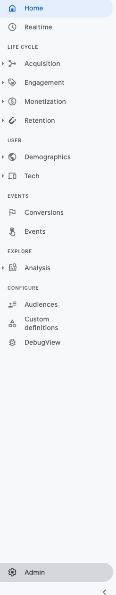
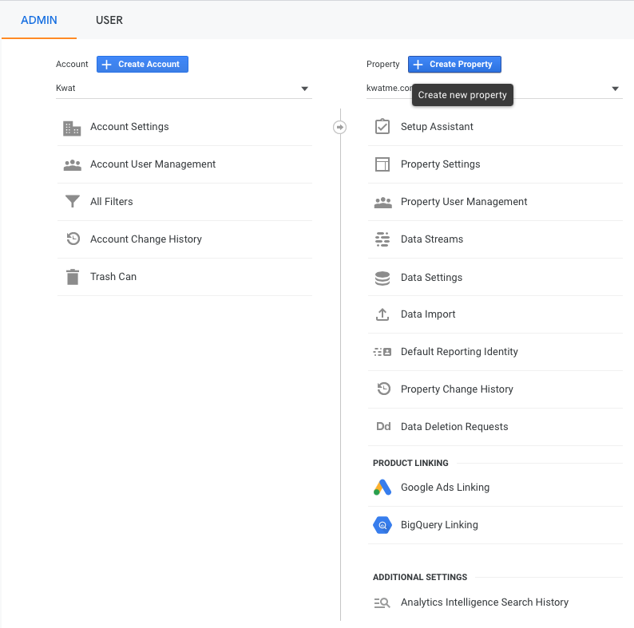
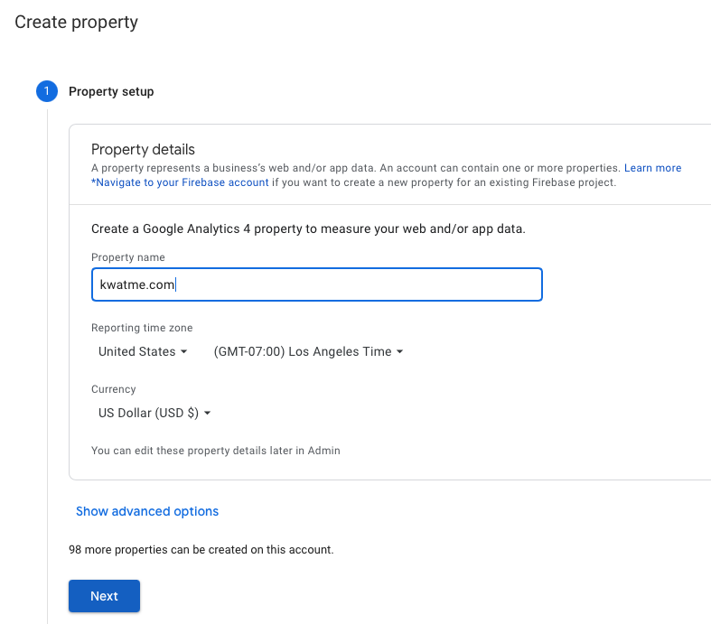
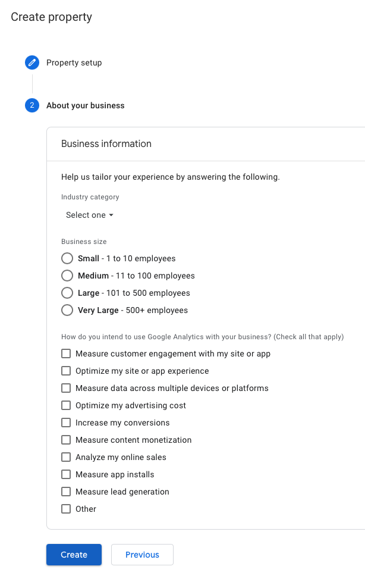
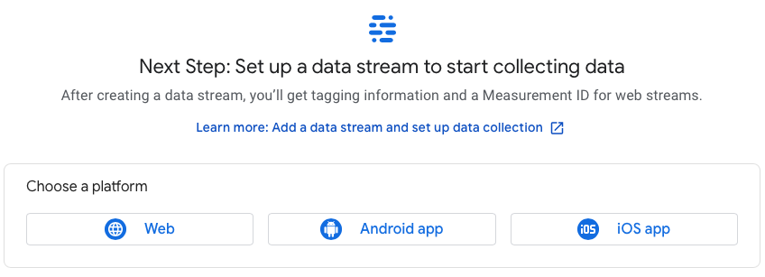
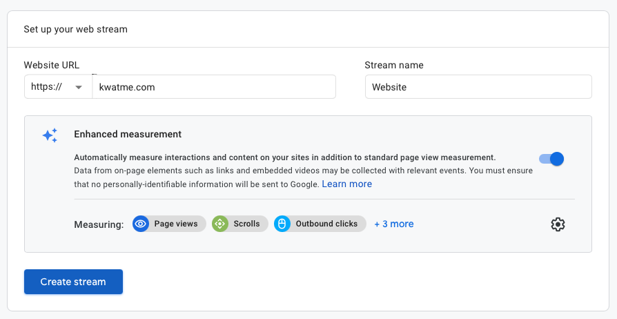
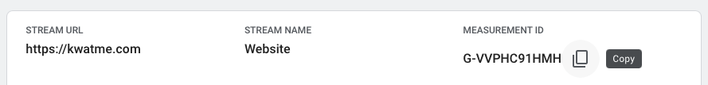
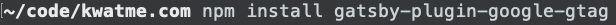

Go to Google Analytics.

Go to Admin:



(Create Account if you haven't.)

Create Property.



Enter Property name.
(I just use the URL.)



If you want, provide information.
(I don't.)

Create.



To collect a website data, set up a data streatm for web.



Enter the URL and a name.

Create stream.



Copy the measurement ID.



In the project, npm install gatsby-plugin-google-gtag.



Edit project/gatsby-config.js.
Add to the plugins, using the copied measurement ID:

```
{
  resolve: `gatsby-plugin-google-gtag`,
  options: {
    trackingIds: ["G-XXXXXXXXXX"],
  },
},
```


Git add, commit, and push.
Update the website.

Go to the website and confirm that Google Analytics sees the traffic.
If not, try accessing the website from various sources (laptop, phone, and other devices).
